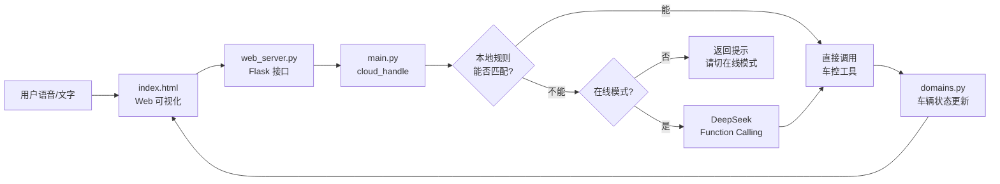
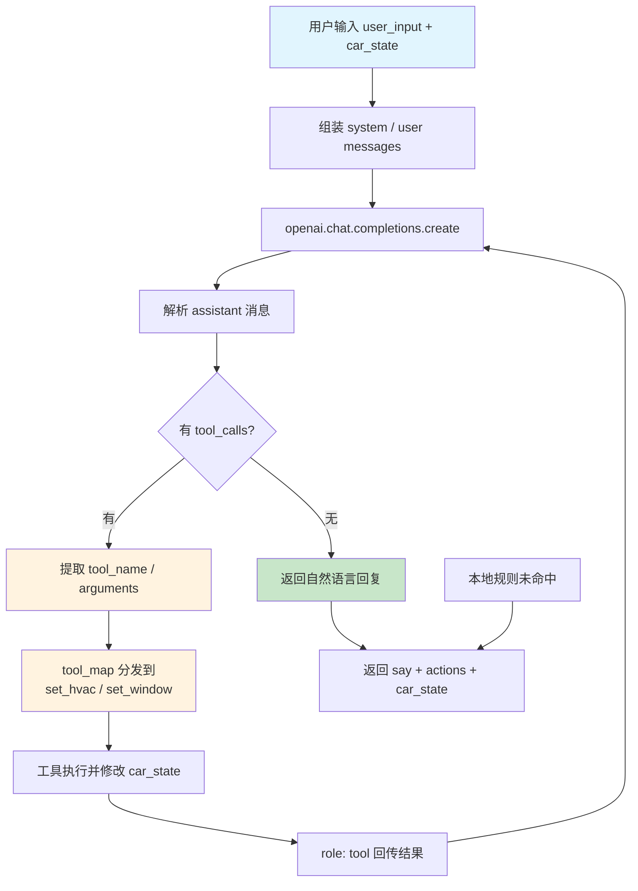
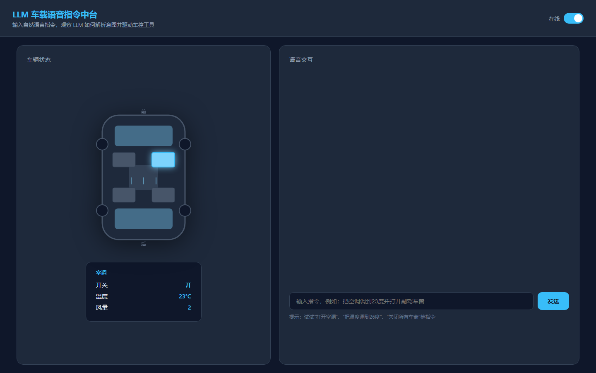
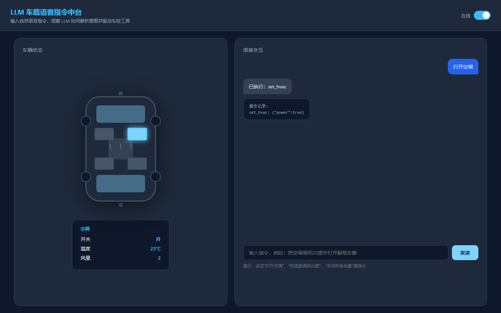
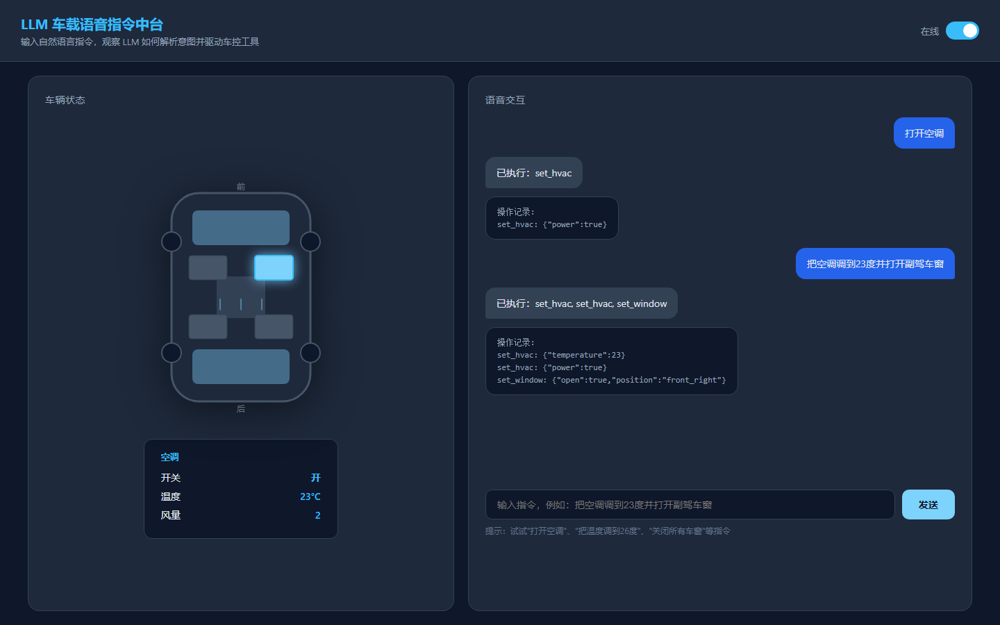
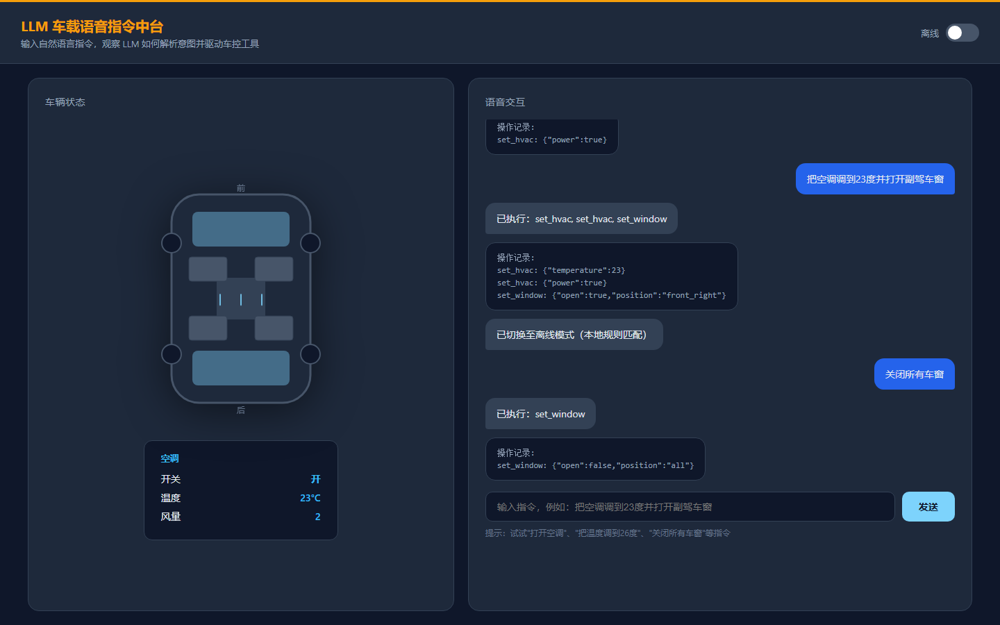

# cockpit-voice-agent

LLM 车载语音指令中台。用 LLM 重新构建车载语音中控：从"背命令"变成"懂人话"。用户只需用自然语言描述需求，系统自主理解意图并调用空调、车窗、电话、蓝牙音乐等车控与车载软件能力。

---

## 项目意义

传统车载语音系统是一个**命令复读机**：

- 用户必须说"打开空调"，不能说"我有点热"
- 必须说"关闭车窗"，不能说"把窗户关上"
- 多步骤操作要拆成多条指令，一句"空调调到 23 度并打开副驾车窗"无法处理
- 每新增一个功能（蓝牙音乐、电话、导航），都要单独做语音识别和命令映射

本项目让 LLM 坐在中控后面做真正的大脑：

- **理解自然语言**：用户说"我有点热"，LLM 自己判断要开空调
- **复合指令一次执行**：一句话里多个操作，LLM 自动拆解为多个工具调用
- **可扩展软件生态**：空调、车窗只是开始，未来可接入电话、蓝牙音乐、导航、座椅按摩等车载软件
- **离线兜底 + 在线大脑**：有网时 LLM 自主决策；没网时切换本地规则库，保证基础车控可用

最终目标：**用户只用自然语言说出需求，中控平台自己决定调用哪些车载能力完成它。**

---

## 架构图

### 1. 整体交互流



### 2. Function Calling 消息流转

对应 `main.py` 与 `call_llm.py` 的完整执行逻辑：



> 注：若 LLM 一次请求多个工具，会并行执行；若需要基于工具结果再次判断，会进入多轮工具调用循环。

---

## 快速开始

### 1. 环境准备

```bash
# 克隆仓库
git clone https://github.com/LiMuBai-QiuWuJi/cockpit-voice-agent.git
cd cockpit-voice-agent

# 创建虚拟环境
python -m venv .venv
# Windows
.venv\Scripts\activate
# macOS/Linux
source .venv/bin/activate

# 安装依赖
pip install -r requirements.txt
```

### 2. 配置 API Key

在项目目录创建 `.env`：

```bash
# Windows PowerShell
New-Item .env
# macOS/Linux
touch .env
```

编辑 `.env`，填入你的 DeepSeek API Key：

```env
DEEPSEEK_OPENAI_API_KEY=sk-your-api-key-here
```

### 3. 启动 Web 可视化服务

```bash
python web_server.py
```

浏览器访问：`http://127.0.0.1:5000`

### 4. 体验

在页面右上角切换**在线 / 离线**模式，输入指令：

```text
打开空调
把温度调到 23 度
打开副驾车窗
把空调调到 23 度并打开副驾车窗
我有点热
```

---

## 在线 / 离线双模式

| 模式 | 处理逻辑 | 适用场景 |
|---|---|---|
| **在线** | 任何输入优先走本地规则库；本地未命中再走 DeepSeek LLM | 有网络时，LLM 作为大脑理解任意自然语言 |
| **离线** | 仅使用本地规则库匹配基础车控指令 | 隧道、地下车库等弱网环境，保证空调/车窗可用 |

> 设计意图：离线库不是"降级版"，而是在线模式的第一道过滤器。常见指令本地快速执行，省钱、低延迟、响应快；复杂语义再走 LLM。

---

## 目录结构

```
cockpit-voice-agent/
├── main.py                 # 云端处理入口：在线/离线切换、LLM 调用、工具分发
├── web_server.py           # Flask Web 服务，提供 /api/chat、/api/mode、/api/state
├── index.html              # Web 可视化：车模型 + 语音交互面板 + 在线/离线开关
├── call_llm.py             # LLM 通信统一封装：CallParameters + ChatSession + 工具循环 + 重试
├── realCarSimulation.py    # 车端模拟入口，模拟 CAN/车端上传 car_state
├── domains.py              # 车辆状态常量与初始状态
├── skill/                  # 车控工具目录
│   ├── set_hvac/           # 空调控制（power / temperature / fan_speed）
│   └── set_window/         # 车窗控制（front_left / front_right / rear_left / rear_right）
├── requirements.txt
└── README.md
```

---

## 技术要点

| 模块 | 实现 |
|---|---|
| **意图理解** | DeepSeek Function Calling（在线） / 本地规则匹配（离线） |
| **车云分层** | 车端 JSON 上传 `car_state`，云端无状态处理，返回 `say + actions` |
| **工具调用** | `tool_map` 字典直传，`call_llm.py` 支持多轮工具循环 |
| **会话管理** | `ChatSession` 支持 `context_mode`（none/recent/unlimited）历史裁剪 |
| **可视化** | 纯前端 SVG 车模型 + CSS 动画，实时反馈车窗 / 空调状态 |
| **双模式** | `USE_ONLINE_LLM` bool 变量控制；Web 页面可动态切换 |

---

## 可扩展方向

当前已接入空调、车窗两个工具，但架构已经为扩展做好准备：

1. 在 `skill/` 下新增工具目录（如 `make_call`、`play_bluetooth_music`）
2. 定义 JSON Schema 描述工具参数
3. 在 `main.py` 的 `TOOLS` 与 `TOOL_MAP` 中注册
4. LLM 即可自主决定何时调用它

未来可接入的车载软件能力：

- 电话拨打 / 接听 / 查询通讯录
- 蓝牙音乐播放 / 暂停 / 切歌 / 搜歌
- 导航设置目的地 / 规避拥堵
- 座椅加热 / 通风 / 按摩
- 氛围灯颜色 / 亮度
- 雨刮、后视镜、后备箱等车身控制

**核心不变**：用户只用自然语言描述需求，LLM 自己决定调用哪些车载能力完成。

---

## 运行截图

### 初始状态



### 在线模式：打开空调



### 在线模式：复合指令



### 离线模式：关闭所有车窗



---

## 已知问题

- 离线规则库目前只覆盖空调和车窗的基础说法，复杂表达（如"我觉得有点闷"）需要在线 LLM 处理
- 车窗位置关键词需要继续补充口语化说法（如"司机这边"、"副驾驶那边"）
- 缺少行驶状态安全约束（如行驶中禁止打开天窗、高速限制车窗全开）

